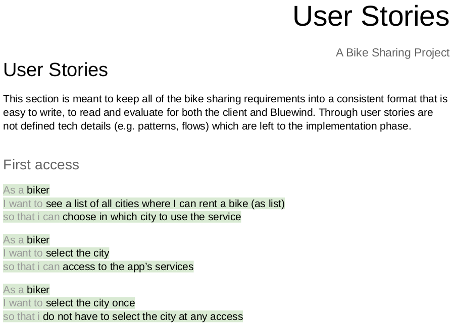
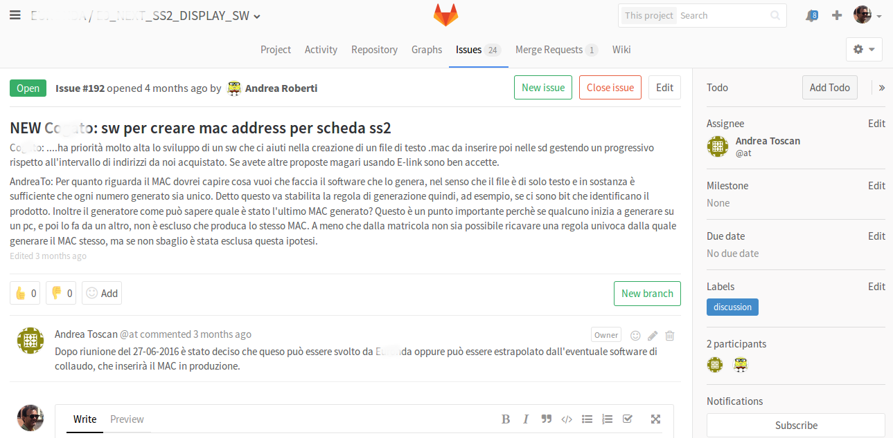

layout: true
.footer[
Software development training: requirements and specifications
]

???
---

# Software development training

### Requirements and specifications

???
---

.left-column[
## An exciting new world
]

.right-column[
*No more money*

*No more time*

  - Minimum viable product
  - Minimun viable specification

> Someone is still waiting for specification to be defined before designing the product. He will be fired.
]

???
---

.left-column[
## How would you like to develop?
]

.right-column[
Obvious desires

  - automation
  - pairing
  - show the value
  - automatic and pragmatic testing
  - test while developing
  - sustainable pace
  - refactoring
]

???
---

.left-column[
## New / Old paradigm in business process
]

.right-column[


https://www.gov.uk/service-manual
]

???
---

.left-column[
## The Agile Manifesto on documenting
]

.right-column[
*Working software over comprehensive documentation*
]

???
---

.left-column[
## Methodologies
]

.right-column[
 *Process template*
 
   - a guide to values and principles
   - the risk of imposing methods
   - should be tailored
   - follow the rule, break the rule, be the rule
]

???
---

.left-column[
## Why specifying
]

.right-column[


https://www.gov.uk/service-manual
]

???
---

.left-column[
## Why specifying
]

.right-column[
Specifications are very often linked to the need for:

  - estimating
  - quality assuring
  - business results
]

???
---

.left-column[
## Why specifying
]

.right-column[
Specifications maintain a low defects count

```
Consider that on average 60-70% of all defects
can be categorized as requirements related.
Following a disciplined approach with robust tools
and process mechanisms in place has been shown to
consistently reduce cost and improve product quality.
```

http://electronicdesign.com/archive/requirements-driven-development-too-challenging-be-worth-it
]

???
---

.left-column[
## Let's adopt a disciplined approach!
]

.right-column[
Specifications are impossible to be maintained

```
Ever talk to a customer?
Requirements should quantify and communicate
the customer’s concept of a product,
but often customers don’t know what they need.
They have fuzzy ideas of what they want
and have a tendency to focus on
how a system should be developed
instead of what a system’s behavior
and constraints should entail.
```
]

???
---

.left-column[
## Different specifications
]

.right-column[
Specifications are determined by:

  - point of view
  - actors availability for interview
  - available budget
]

???
---

.left-column[
## Requirements
]

.right-column[
Specifications should be documented as:

  - user requirements
  - cost requirements
  - sector related requirements
]

???
---

.left-column[
## Requirements change
]

.right-column[
Be smart

  - use backlog
  - define your tasks for the week
  - maintain a fixed schedule for your week
]

???
---

.left-column[
## An exercise
]

.right-column[
Try specifying a product with a drawing

  - drawing creates empathy
  - drawing stimulates sleeping brain areas
]

???
---

.left-column[
## Drawing
]

.right-column[
Try specifying this product with words


]

???
---

.left-column[
## Drawing
]

.right-column[
The advantages of drawing

  - drawing uses a common language and reuses assumptions
  - a few words that explain to anyone

> The Viggen Two Development Board: is designed specifically to accommodate the Viggen Two SOM and offer a wide range of connectivity through the most standard radio and wired interface. The board allows the programmer to program and debug the Viggen Two SOM through USB interface or standard JTAG connector*
]

???
---

.left-column[
## Points of view: who reads specifications
]

.right-column[
*The product owner*

The person who knows where to go.

  - the client
  - the developer
  - the marketing manager
  - the team
]

???
---

.left-column[
## An example
]

.right-column[
This coffee machine should be upgraded on the field


]

???
---

.left-column[
## The interview
]

.right-column[
Why asking

  - need for understanding: code less, code better
  - need for asking: no single person exists that understands the product
  
Ask your product owner what and how: he will tell the story.
]

???
---

.left-column[
## The natural way: User Stories
]

.right-column[

]

???
---

.left-column[
## User Stories: why writing them
]

.right-column[
*You should make sure every member of your team
writes user stories and uses them to:*

  - track everything they need to do
  - think about their work from a user’s perspective
  - discuss their work with colleagues
  - prioritise their work
]

???
---

.left-column[
## User Stories: what to include
]

.right-column[
*Enough information for your product manager
to decide how important the story is.*

  - the person using the feature (the actor)
  - what the user needs the feature for (the narrative)
  - why the user needs the feature in the end (the goal)
]

???
---

.left-column[
## User Stories: how it should be
]

.right-column[
The story should be INVEST

  - independent
  - negotiable
  - valuable
  - estimable
  - small
  - testable

]
???
---

.left-column[
## User Stories: how to build a story
]

.right-column[
A scheme

  - As a... *who's using this story?*
  - I need/want/expect to... *what's the goal of this?*
  - So that... *why should I want this?*

The focus is the goal. If you can't write the goal
then are you sure you need that feature?
]

???
---

.left-column[
## User Stories: discuss
]

.right-column[
The essence of a user story is discussion.

  - discovers details
  - creates a relationship with the product owner
  - builds a team
]

???
---

.left-column[
## User Stories: kinds
]

.right-column[
Three levels

  - Epics
  - Stories
  - Tasks
]

???
---

.left-column[
## Epics
]

.right-column[
What's an epic

  - *Large collection of personas, features and business requirements*
  - *Big user storie*

.pure-table.pure-table-bordered.pure-table-striped.smaller-font[
|                  |            |
|------------------|------------|
|*As an installer:*  | I want to be able to set the country before installing  |
|*so that:*          | I'm able to show the client the product out of the box  |
]

Description of "what" and not "how" or "how much"
]

???
---

.left-column[
## Stories
]

.right-column[
What's a story

  - *Actions the user need to take in order to achieve
the desired outcome, and the components that go into it*
  - *Something a user wants*

.pure-table.pure-table-bordered.pure-table-striped.smaller-font[
|                  |            |
|------------------|------------|
|*As an installer:*  | I want to be able to consult a list of countries on the web  |
|*so that:*          | I can decide which country to set without powering the device on  |
]

.pure-table.pure-table-bordered.pure-table-striped.smaller-font[
|                  |            |
|------------------|------------|
|*As an installer:*  | I want to be able to set the country before switching the product on  |
|*so that:*          | I don't need to cable the product  |
]
]

???
---

.left-column[
## Tasks
]

.right-column[
What's a task

  - *Development step to release a story*
  - *Minimum measureable development action*
]

???
---

.left-column[
## Stories format
]

.right-column[
Put requirements in first person

The Beatles:

  - She Loves You
  - I Wanna Hold Your Hand
  - Baby You Can Drive My Car

These helped people more closely identify with the songs.
]

???
---

.left-column[
## Stories format
]

.right-column[
Try helping prioritize

Giving the stories a structure helps the product owner prioritize

  - let's help the installer set country
  - don't need to power the product on while setting a country
  - prepare a website for listing countries
]

???
---

.left-column[
## Stories format
]

.right-column[
Do not avoid sentences


How do you read this?
]

???
---

.left-column[
## Stories format
]

.right-column[
How and when shoud I go deep into specifications?

  - time rules
  - technical details can be important (tenders)
  - sometimes technical details can be overkill
]

???
---

.left-column[
## Complex first
]

.right-column[
Start from complicated points:

  - technical difficulties
  - business model difficulties
  - start from difficult problems
  - specify early, will work as a proof of concept
]

???
---

.left-column[
##  Meetings: how to take note
]

.right-column[
Simple as it should be: cards posted on your wall.

  - one white paper sheet per story
  - text (markdown) document
  - markdown document converted to HTML (this slide)
  - issue / ticker on a managed version control platform
]

???
---

.left-column[
## Or use tools
]

.right-column[

]

???
---

.left-column[
## Missing specifications
]

.right-column[
When documentation is a weak point:
  
  - try diving information you already have
  - try using pieces of information for a reasonable development
  - get out of the building

Ask yourself:

*how will this be used?*

*how has this always been used?*
]

???
---

.left-column[
## Ideas for a change
]

.right-column[
Ted conferences:

  - passionate speakers that create a show
  - a show is another way of stimulating for change
  - change your mindset during specification will bring benefits
    to the entire project design cycle
  - have a look at *Start with why* (Simon Sinek)
]

???
---

## Any Question?

Let's keep in touch!

mail: stefano.costa@bluewind.it

twitter: @stefanobluewind

company: www.bluewind.it
