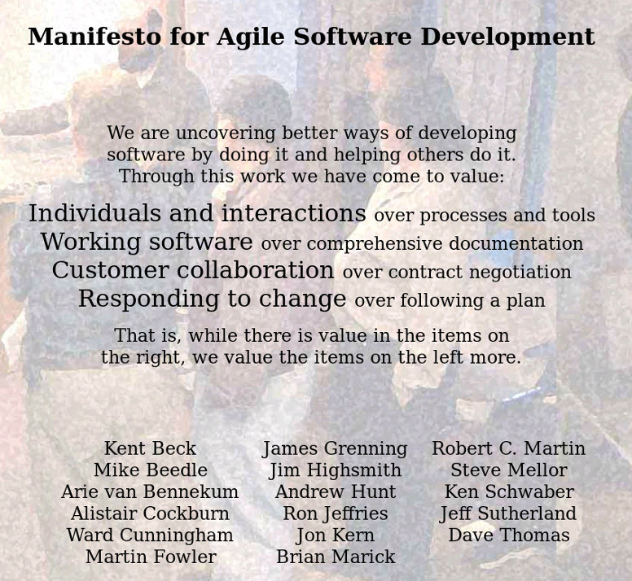
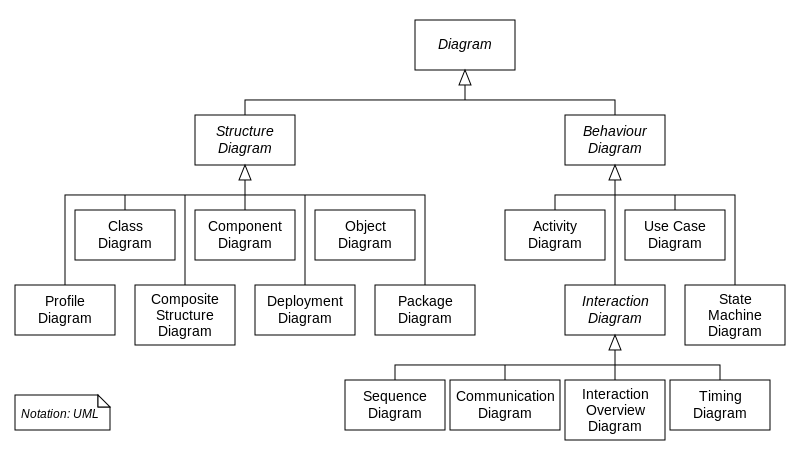

layout: true
.footer[
Software development training: UML descriptions
]

???
---

### *UML descriptions*

## Index

  - Software development process: the problem
  - Someone thinks about
  - The idea: Agile
  - The method: Unified Software Development
  - The Language: UML
  - From formal description to code

???
---
  
## Software development

  - Get requirements
  - The problem is simple for me: start coding!
  - Ops ....
  


???
---

## Software development

So which approach? 

???
---

## Waterfall

  - 1970: first formal description
  - Sequential design process in which progress is seen as flowing steadly downwards


???
---

## Waterfall

Criticism:

```
clients may not know
what exactly their requirements are
before they see working software
```

???
---

## Lightweight

  - 1974: adaptive software development process
  - 1994: Unified Process
  - 1995: SCRUM
  - 1996: XP
  - 1997: Adaptive software development

???
---

## Agile Programming: the manifesto


 
???
---

## Agile: a few manifesto words

*The Agile movement is not anti-methodology, in fact, many of us want to restore credibility to the word methodology. We want to restore a balance. We embrace modeling, but not in order to file some diagram in a dusty corporate repository. We embrace documentation, but not hundreds of pages of never-maintained and rarely-used tomes. We plan, but recognize the limits of planning in a turbulent environment. Those who would brand proponents of XP or SCRUM or any of the other Agile Methodologies as "hackers" are ignorant of both the methodologies and the original definition of the term hacker.*

???
---

## Agile Programming: it doesn't mean

Not so simple to be explained


We are "Agile"


???
---

## Unified Software Development Process

Popular iterative and incremental software development process framework
 


???
---

## Unified Software Development Process

The Unified Process divides the project into four phases:

  - Inception Phase
  - Elaboration Phase
  - Construction Phase
  - Transition Phase

???
---

## Unified Software Development Process

(1) Inception Phase:

*business case and context, success factors and financial forecast is established *

???
---

## Unified Software Development Process

(2) Elaboration Phase:

*the problem domain analysis si made and the architecture gets its basic*
???
---

## Unified Software Development Process

(3) Construction Phase:

*Build the software system (iterations may be developed in the effort)*

???
---

## Unified Software Development Process

(4) Transition Phase:

*from development to production*

???
---

## How can I describe and explain my idea?

 - Engineers in other disciplines have long used blueprints and models to design and construct complex systems.
 - A system can be described in different ways: which is the best one?


???
---

## How can I describe and explain my idea?

The idea: the "Three Amigos" create a standard language that can really show the system    


 
???
---

## History of Unified Modeling Language


???
---

## UML: What is it? (1)

  - The UML notation set is a language and not a methodology
  - It provides a good bird's eye view as well as the minute details
  - One reason UML has become a standard modeling language is that it is programming-language independent

???
---

## UML: What is it? (2)

  - The Object Management Group (OMG) is the body responsible for creating and maintaining the language specifications
  - Current modeling trends involve models that can be translated into compilable and runable code. This is known as Model Driven Architecture (MDA) and is also being regulated by the OMG

???
---

## UML: and in detail? (1)

The Object Management Group (OMG) developed a metamodeling architecture to define the Unified Modeling Language (UML) called the Meta-Object Facility (MOF)


???
---

## UML: and in detail? (2)

The Meta-Object Facility is designed as a four-layered architecture:

  - M3: meta-meta model
  - M2: metamodel
  - M1: system models 
  - M0: running system

???
---

## UML: and in detail? (3)

M3: Level for defining modeling elements (meta-meta model)

  - The metaclasses Class, Association, Attribute, etc are all instances of MOF class

???
---

## UML: and in detail? (4)

M2: Level of modeling element definition (metamodel)

  - **The model that describes the UML itself.**
  - Each class in M1 is an instance of some class describing element in layer M2 (Metaclass)
  - Each association in M1 is an instance of some association describing element in layer M2 (Metaassociation)

???
---

## UML: and in detail? (5)

M1: Level of system models

  - UML model of a software system 

???
---

## UML: and in detail? (6)

M0: Level of the running system

  - Corresponds to object diagram

???
---

## UML: Diagrams (1)

UML uses diagrams to rappresent two views of a system model



???
---

## UML: Diagrams (2)

Static (or structural) view:

  - emphasizes the static structure of the system using objects, attributes, operations and relationships. 
  - class diagrams, composite structure diagrams

Dynamic (or behavioral) view:

  - emphasizes the dynamic behavior of the system by showing collaborations among objects and changes to the internal states of objects.
  - sequence diagrams, activity diagrams, state machine diagrams.


???
---

## UML: Use-Case Diagram (1)


???
---

## UML: Use-Case Diagram (2)


 - A use case illustrates a unit of functionality provided by the system
 - The main purpose of the use-case diagram is to help development teams visualize the functional requirements of a system.
 - A use-case diagram is typically used to communicate the high-level functions of the system and the system's scope

???
---

## UML: Class Diagram (1)


???
---

## UML: Class Diagram (2)


 - The class diagram shows how the different entities (people, things, and data) relate to each other; in other words, it shows the static structures of the system
 - A class diagram can be used to display logical classes, which are typically the kind of things the business people in an organization talk about
 - Class diagrams can also be used to show implementation classes, which are the things that programmers typically deal with

???
---

## UML: Sequence Diagram (1)


???
---

## UML: Sequence Diagram (2)


Sequence diagrams show a detailed flow for a specific use case or even just part of a specific use case
 
A sequence diagram has two dimensions

  - The vertical dimension shows the sequence of messages/calls in the time order that they occur
  - The horizontal dimension shows the object instances to which the messages are sent. 

???
---

## UML: State chart Diagram (1)


???
---

## UML: State chart Diagram (2)


 - The statechart diagram models the different states that a class can be in and how that class transitions from state to state
 
???
---

## UML: Activity Diagram (1)


???
---

## UML: Activity Diagram (2)


- Activity diagrams show the procedural flow of control between two or more class objects while processing an activity
- Activity diagrams are best used to model higher-level processes, such as how the company is currently doing business, or how it would like to do business

???
---

## UML: Component Diagram (1)


???
---

## UML: Component Diagram (2)


 - A component diagram describes the organization and wiring of the physical components in a system
 - Its purpose is to show the dependencies that the software has on the other software components (e.g., software libraries) in the system

???
---

## UML: Deployment Diagram (1)


???
---

## UML: Deployment Diagram (2)


- The deployment diagram shows how a system will be physically deployed in the hardware environment.
- Its purpose is to show where the different components of the system will physically run and how they will communicate with each other.


???
---

## UML: which instruments?

In the market there are many instruments

``` 
AgileJ StructureViews, ArgoUML, Astah, ATL, Borland Together, BOUML, CaseComplete, ConceptDraw PRO, Creately for UML, Dia, Eclipse, Edraw Max, Enterprise Architect, Gliffy, JetUML, LucidChart, MagicDraw, Microsoft Visio, Modelio, MyEclipse, NClass, NetBeans, Open ModelSphere, Papyrus, PlantUML, Poseidon, PowerDesigner, Prosa, Rational Rhapsody, Real Time Developer Studio, Software Ideas, StarUML, Umbrello, UML Designer, UMLet, UModel, Visual Paradigm for UML
```

???
---

## UML adavantages

  - Visual Representation: UML breaks the complex system into discrete pieces that can be understood easily
  - Handover the system to new team becomes easier
  - Readability and Re-usability
  - Standard

???
---

## UML disavantages

  - Not a common language for all stakeholders
  - Diagrams Can Get Overwhelming
  - Too Much Emphasis on Design
  - Time (when it is not used to generate code)
  - Tries to be all things to all people

  
???
---

## UML: how Bluewind is using it

  - design the use cases
  - define the domains
  - define the classes
  - draw the state machines


???
---

## Use case example (1)


???
---

## Use case example (2)


???
---

## Design the domain


???
---

## Design a Package


???
---

## Struct and Attributes


???
---

## Struct and Attributes


???
---

## Design a state machine


???
---

## Design a state machine


???
---

## UML: code generation (1)


???
---

## UML: code generation (2)


???
---

## UML: code generation (3)


???
---

## UML: code generation (4)


???
---

## Code mantainance

  - Now our code can be generated automatically!
  - It is bug free ....


  - Probably no, but it is easer to modifiy the code to solve a bug without destroy other functionalities.

???
---

## Credits: the web

  - agilemanifesto.org
  - www.uml.org
  - www.ibm.com/developerworks/rational
  - www.omg.org
  - www.sparxsystems.com
  - www.eclipse.org/papyrus
  - www.visual-paradigm.com
  - www.wikipedia.com
  - dilbert.com   

???
---

## Credits: the paper

  - Grady Boock, James Rumbaugh, Ivor Jacobson: *The Unified Modeling Language User Guide*, 1999
  - Martin Fowler: *Refactoring Improving the Design of Existing Programs*, 1999
  - Martin Fowler, Kendall Scott: *UML distilled*, Second Edition, 2000
  - Grady Boock, James Rumbaugh, Ivor Jacobson: *The unified Modeling Language Reference Manual*, 2005  

???
---

## Any Question?

Keep in touch!


mail: andrea.toscan@bluewind.it

twitter: @andreatoscan

linkedin: it.linkedin.com/in/andreatoscan
