layout: true
.footer[
Software development training: software quality
]

???
---

# Software development training

### Software quality, design for testability

???
---

.left-column[
## Sit down and start thinking
]

.right-column[
> One timeless way of building (Christopher Alexander, cit. Peopleware - DeMarco/Lister)

  - find the *one timeless way of building*
  - find *patterns*

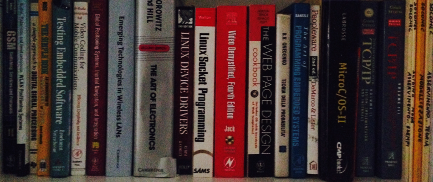
]

???
---

.left-column[
## Better software
]

.right-column[
Always consider software development as a process

  - four keywords driving effective development
  - design for test
  - in the meantime: selected tools
]

???
---

.left-column[
## Software development as a process
]

.right-column[
### The art of bike maintenance


will you ever build from scratch??

Always *repair* and *enhance*
]

???
---

.left-column[
## Software development as a process
]

.right-column[
### The art of bike maintenance

follow the process:

  - sit down
  - check and prepare tools
  - list things to be done
  - do them
  - carefully test
  - deliver
]

???
---

.left-column[
## Software development as a process
]

.right-column[
### Four keywords

  - visibility
  - accountability
  - automation
  - testability
]

???
---

.left-column[
## Visibility
]

.right-column[
### Developed code is published

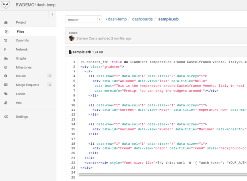

Should be written to be readable, comments included.
Good english language counts.
]

???
---

.left-column[
## Visibility
]

.right-column[
### Developed code is published

  - issues
  - code review
  - standards adoption
  - architecture sharing
]

???
---

.left-column[
## Accountability
]

.right-column[
### Requirements

  - start point
  - end point
]

???
---

.left-column[
## Accountability
]

.right-column[
> anything that's not published (internally) does not exist

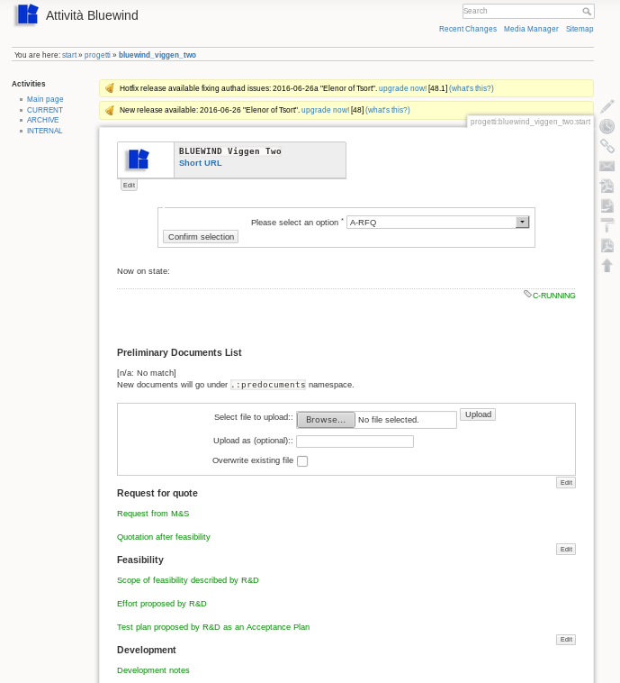

https://www.dokuwiki.org/
]

???
---

.left-column[
## Accountability
]

.right-column[
### Requirements come in so many different ways

use cases:

  - intermediate deliveries
  - discussion on features / price
  - focus on product and not details
  - discovers hidden costs

meetings logs:

  - very simple

log books:

  - why and when
]

???
---

.left-column[
## Accountability
]

.right-column[
### Delivery as a single traceable action

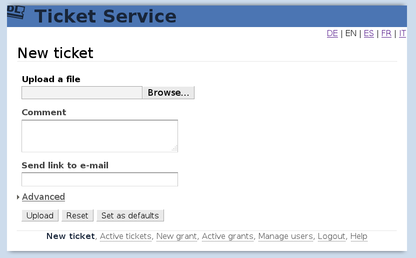
]

???
---

.left-column[
## Accountability
]

.right-column[
### Delivery as a single traceable action

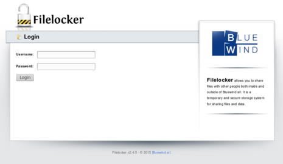

http://www.thregr.org/~wavexx/software/dl/

http://filelocker2.sourceforge.net/
]

???
---

.left-column[
## Automation
]

.right-column[
### Starting a new project

> identify and setup a full release cycle

  - simplify
  - automate
  - think big
  - start iterating
]

???
---

.left-column[
## Automation
]

.right-column[
### Simplify and automate

Example: this slide

  - written in *markdown*
  - rendered with *remark.js*
  - processed using a *makefile*
  - converted with *pandoc* in different formats
  
focus on microservice, microtools

```md
## Automation

simplify, example: this slide

  - written in *markdown*
  - rendered with *remark.js*
  - processed using a *makefile*
  - converted with *pandoc* in different formats
  
focus on microservice, microtools
```
]

???
---

.left-column[
## Automation

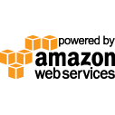
]

.right-column[
### Automate with any available tool

example: deploy on *AWS* using *Ansible* from a *Raspberry PI*

  - deploy a 32 cores / 60Gb / Ubuntu development host in 5'
  - install Eclipse CDT, clone your project
  - as simple as a shell command in Linux
  - full example available, see link below

https://github.com/bluewindthings/ansible-aws
]

???
---

.left-column[
## Testability
]

.right-column[
### Theory and practice

> write tests before (TDD)

in practice:

  - keep it simple, short functions
  - think about how to inspect *the inner behaviour*
  - *simulate*
  - prepare for *iteration* of scenarios
]

???
---

.left-column[
## Testability
]

.right-column[
### Size (of functions) does matter

  - one function fits all

```c
int meanvalue_from_adc (void) {
  /* get value from ADC, accumulate, mean over samples...
}
```

  - simple functions linked by data structures

```c
int read_adc (void) {
  /* get value from ADC, push in a queue...
}

int meanvalue (void) {
  /* pull value from a queue, accumulate, mean over samples...
}

```
]

???
---

.left-column[
## Meet Uniti, Sweden
]

.right-column[
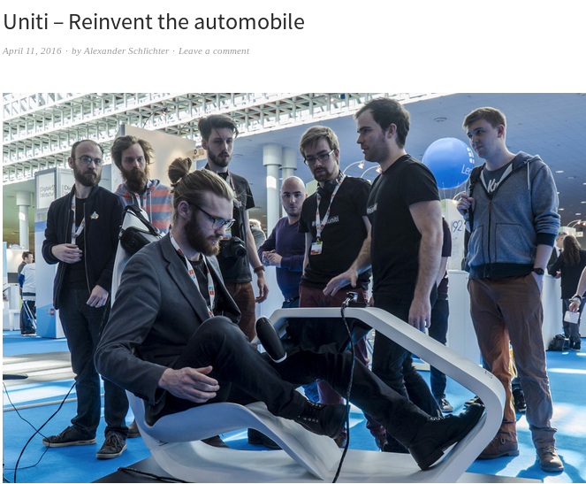

http://www.unitisweden.com/team-page/
]

???
---

.left-column[
## Meet your bench
]

.right-column[
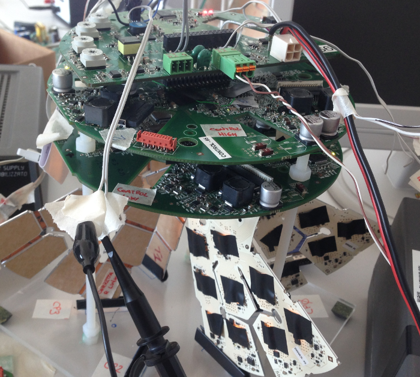
]

???
---

.left-column[
## Use rules and automation
]

.right-column[
Follow the rule, break the rule, be the rule

Automation is the key factor to quality and testability
]

???
---

.left-column[
## Reuse
]

.right-column[
### Reuse or develop new

> when should I reuse existing solutions?
  
always. dot.

> what should I reuse?
  
existing solutions from *any available source*
]

???
---

.left-column[
## Reuse
]

.right-column[
Reusing gives:

  - comfort
  - disruptiveness
  - less lock-in
  - understand inside
  - curiosity
  - expertise
]

???
---

.left-column[
## Reuse
]

.right-column[
### Notable examples

  - `gettext`
  - `protobuf`
]

???
---

.left-column[
## Too many rules?
]

.right-column[
.pure-table.pure-table-bordered.pure-table-striped.smaller-font[
|Authors  |Title    |Pages
|---------|---------|------
|Steve McConnel  |"Code Complete"  |900  |
|Bart Broekman and Edwin Notenboom  |"Testing Embedded Software"  |368  |
|    |"MISRA-C Guidelines 2004"  |116  |
]
]

???
---

.left-column[
## Measuring code
]

.right-column[
How to measure the complexity and why?

  - is library (A) more or less complex than library (B)?
  - how much time for debugging project (C)?
  - what's the quality of this inherited code base?
  - why not measure the final result of such an expensive process?
]

???
---

.left-column[
## Measuring: LOC
]

.right-column[
### Cloc

http://cloc.sourceforge.net/

*Count lines of code*: way too easy!
]

???
---

.left-column[
## Measuring: LOC
]

.right-column[
### Results

```bash
user@host:~/code$ cloc medical-project/
     140 text files.
     140 unique files.
      59 files ignored.
```

.pure-table.pure-table-bordered.pure-table-striped.smaller-font[
|Language  |files  |blank  |comment  |code
|----------|-------|-------|---------|-----
|C                |51           |5140          |12329          |14819
|C/C++ Header     |64           |9081          |11182          |12086
|C++              |6            |843           |1917           |856
|Bourne Shell     |1            |0             |14             |14
|SUM              |122          |15064         |25442          |27775
]
]

???
---

.left-column[
## Measuring: cyclomatic complexity
]

.right-column[
### Cyclomatic: a definition

Cyclomatic from *Wikipedia* the free encyclopedia

> Cyclomatic complexity is a software metric (measurement),
used to indicate the complexity of a program.
It is a quantitative measure of the number
of linearly independent paths through a program's source code.
It was developed by Thomas J. McCabe, Sr. in 1976.
]

???
---

.left-column[
## Measuring: cyclomatic complexity
]

.right-column[
### Details

  - cyclomatic complexity is computed using the control flow graph
    of the program
  - the nodes of the graph correspond to
    indivisible groups of commands of a program
  - a directed edge connects two nodes if the second command
    might be executed immediately after the first command
  - cyclomatic complexity may also be applied to individual
    functions, modules, methods or classes within a program.
]

???
---

.left-column[
## Measuring: cyclomatic complexity
]

.right-column[
### lizard

Unified tool for metrics written in Python. Includes:

  - the nloc (lines of code without comments)
  - CCN (cyclomatic complexity number)
  - token count of functions
  - parameter count of functions

https://github.com/terryyin/lizard
]

???
---

.left-column[
## Measuring
]

.right-column[
### coala

> coala provides a unified command-line interface for linting and fixing all your code, regardless of the programming languages you use

https://coala.io/

Example .coafile

```bash
[Default]
files = src/*.c,unit/*.cpp
bears = ClangComplexityBear,CPPCheckBear
```
]

???
---

.left-column[
## Measuring: reverse engineering
]

.right-column[
Understand your code to measure its quality

  - using a tool like Embedded Achitect
  - by inspection and drawing
  
> If I can't extract at least a general view of the behaviour, it's broken
]

???
---

.left-column[
## Developing better code
]

.right-column[
### General rules for your everyday tasks

No tooling, no new processes for now.
]

???
---

.left-column[
## Developing better code
]

.right-column[
### System Planning

  - prepare an electrical block diagram before designing. Hardware, software, and testing will understand fast and easy
  - state diagrams everywhere. Can greatly simplify development, and replace most Requirements Documents
]

???
---

.left-column[
## Developing better code
]

.right-column[
###Hardware Prototypes

> Never accept to spend your time on poorly engineered prototypes: work on nicely done mockups.
]

???
---

.left-column[
## Developing better code
]

.right-column[
### Software Development as a process

  - first step: testing firmware. This should be a piece of autonomous software with reduced complexity, can serve as a draft but will most often be thrown away
  - second step: software test environment (unit, CI, test plan)
  - third step: write what the software should do. State diagram, requirements, just some bullet points
  - always: keep a backlog
  - not alone: at least two people should know how each part works (by testing each other dev?)
]

???
---

.left-column[
## Developing better code
]

.right-column[
### Simplify
  
  - less is more
  - maintainance
  - quality
  
How to simplify while dealing with features

  - develop important features first
  - always invest time before start coding
  - always code for open architecture before coding for features
  - adding new features should be possible with a clear simple design cycle
]

???
---

.left-column[
## Developing better code
]

.right-column[
### Simplify

> Given the same amount of time, a better software engineer will write less code. The best engineer will write zero code (Elliot Chance)

Elliot Chance gives simple and reasonable advices (the next few slides)
]

???
---

.left-column[
## Developing better code
]

.right-column[
### Simplify

Reduce our code base

> I didn't have time to write a short letter, so I wrote a long one instead (Mark Twain)

While coding complexity rises constantly:

  - writing more code is the lazy fix
  - taking more time to find a simple solution is the smart way
]

???
---

.left-column[
## Developing better code
]

.right-column[
### Simplify

Three ages of a software engineer:

  - thrown in the deep end: you want to do the right thing by yourself but you lack of experience
  - too smart for your own good: your code is so refined and smart that you stop understanding it
  - maturity: why did I make this so much more complicated than it needed to be?

> Programs must be written for people to read, and only incidentally for machines to execute (Harold Abelson, Structure and Interpretation of Computer Programs)

Readable code is more efficient.
]

???
---

.left-column[
## Developing better code
]

.right-column[
### Technical debt

Understanding Reduces Code: the problem of technical debt

  - the worst by-product of creating and maintaining software is *technical debt*
  - standards, frameworks and languages change over time: well written code may simply be incompatible years later

> Refactoring will be needed: communication is key
]

???
---

.left-column[
## Software standards
]

.right-column[
### Software manual

Company standard.

An example is given on separate slides.
]

???
---

.left-column[
## Peer programming
]

.right-column[
### Use tools for peer programming

Peer programming is promoted by tools: good quality and simple IDE,
published sources, frequent brief meetings.
]

???
---

.left-column[
## Code review
]

.right-column[
### Use tools for code reviews

> have someone else read and understand your code

When?

  - each commit
  - each merge
  - each issue close
  - each issue open (problem solving)
  - each delivery 

the key is *atomic operations*
]

???
---

.left-column[
## Code review
]

.right-column[
### Use tools for code reviews

> have someone else read and understand your code

  - how?
  - invite with GitLab (tools)
  - automate with CI server
  - comment inline
  - lock merge until comments are processed
]

???
---

.left-column[
## Code review
]

.right-column[
### A workflow: GitLab comments

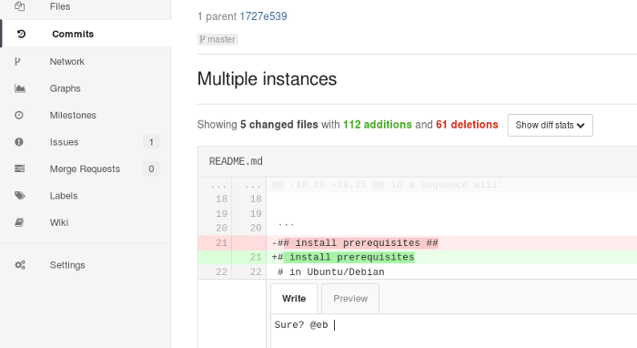
]

???
---

.left-column[
## Testing code
]

.right-column[
### Why testing

Wouldn't be better to test at the end?

> During long software development cycles (years): features that are considered done or stable should not unexpectedly regress. 

> During short software development cycles (months): never spend time where this is not needed.
]

???
---

.left-column[
## Testing code
]

.right-column[
### Testing the right way

  - unit test
  - test driven development
  - integration test
  - risk based testing

> Choose one, make it reusable
]

???
---

.left-column[
## Testing code
]

.right-column[
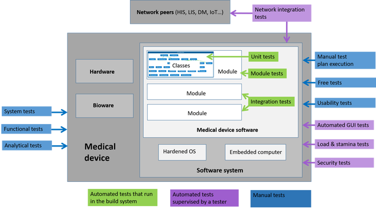

https://agilemeddev.com/2016/09/25/medical-devices-software-testing-overview/
]

???
---

.left-column[
## Static code check
]

.right-column[
### Why static testing

  - because can be automated
  - because it's free
  - because coding is sometimes boring
]

???
---

.left-column[
## Static code check
]

.right-column[
### cppcheck

https://github.com/danmar/cppcheck/

  - Out of bounds checking
  - Memory leaks checking
  - Detect possible null pointer dereferences
  - Check for uninitialized variables
  - Check for invalid usage of STL
  - Checking exception safety
  - Warn if obsolete or unsafe functions are used
  - Warn about unused or redundant code
  - Detect various suspicious code indicating bugs
]

???
---

.left-column[
## Static code check
]

.right-column[
### oclint

http://oclint.org/

  - Possible bugs - empty if/else/try/catch/finally statements
  - Unused code - unused local variables and parameters
  - Complicated code - high cyclomatic complexity, NPath complexity and high NCSS
  - Redundant code - redundant if statement and useless parentheses
  - Code smells - long method and long parameter list
  - Bad practices - inverted logic and parameter reassignment
]

???
---

.left-column[
## Static code check
]

.right-column[
### An example (cppcheck)

```bash
#!/bin/bash
#
CODE_PATH=.
CPPCHECK_OPT='--force --inline-suppr --inconclusive --enable=all'
CPPCHECK_TPL='--template {file}:{line}\t{severity}\t{id}\t{message}'
CPPCHECK_OUT=check.out.txt
CPPCHECK_ERR=check.err.txt
CPPCHECK_SUP='--suppress=variableScope'
cppcheck $CPPCHECK_OPT $CPPCHECK_SUP $CPPCHECK_TPL \
  $(for b in $(for a in $(find "$CODE_PATH" | egrep '\.h$'); \
  do dirname $a; dirname $(dirname $a); done | sort -u); \
  do echo -n " -I $b"; done) "$CODE_PATH" >$CPPCHECK_OUT 2> $CPPCHECK_ERR
```
]

???
---

.left-column[
## Unit test
]

.right-column[
### A definition

Martin Fowler, '90

> The art of running one single function
in a variable and relevant set of conditions

Common elements in order to define unit test as a process:

  - unit tests are low-level, focusing on a small part
of the software system
  - unit tests are usually written by the programmers themselves
using their regular tools
  - unit tests are expected to be significantly faster
than other kinds of tests
]

???
---

.left-column[
## Unit test
]

.right-column[
### Variable elements in order to better specify a unit test process for your needs.

What's a unit?

  - function
  - class
  - module
  - hardware part
]

???
---

.left-column[
## Unit test
]

.right-column[
### Variable elements in order to better specify a unit test process for your needs.

Collaborator isolation

> Should I always mock collaborating units while running unit tests?

  - solitary test
  - sociable test
]

???
---

.left-column[
## Unit test
]

.right-column[
### Variable elements in order to better specify a unit test process for your needs.

When and how often should I run unit tests?

  - compile suite (seconds)
  - commit suite (minutes)
]

???

real life experiences
- Andrea: writing a small fraction of an in-progress project with unit test without even building for the real target
- Enrico: adding unit test to a messed project from a client, only to parts he's adding

---

.left-column[
## Test plan
]

.right-column[
The need for a *documented test plan*

  - iterate
  - report
  - delegate

http://www.tarantula.fi/

http://testopia.blogspot.it/
]

???
---

.left-column[
## Test plan
]

.right-column[
> Delegate: so that testing is really done

An easy delegating process:

  - improves test coverage
  - disseminates knowledge
  - helps understand what I'm doing
  - improves documentation
]

???
---

.left-column[
## Test plan
]

.right-column[
> Prepare a plan

Integration test should be designed:

  - Requirements
  - Sets
  - Cases
  - Executions
  - Test objects
]

???
---

.left-column[
## Test plan
]

.right-column[
Bugzilla and Testopia

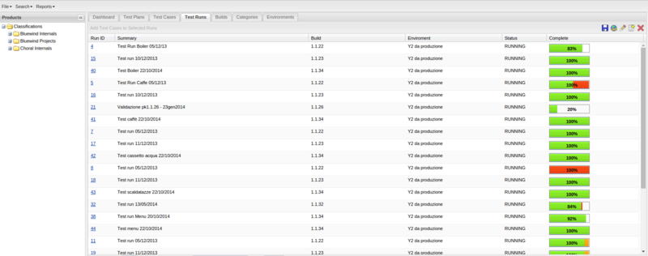
]

???
---

.left-column[
## Test plan
]

.right-column[
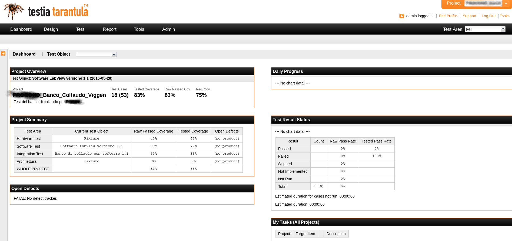
]

???
---

.left-column[
## Test plan
]

.right-column[
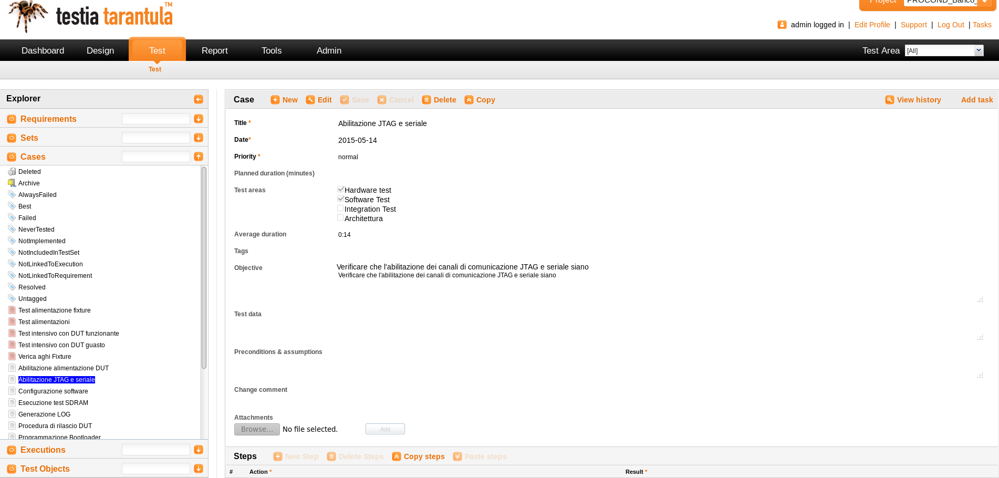
]

???
---

.left-column[
## Test plan
]

.right-column[
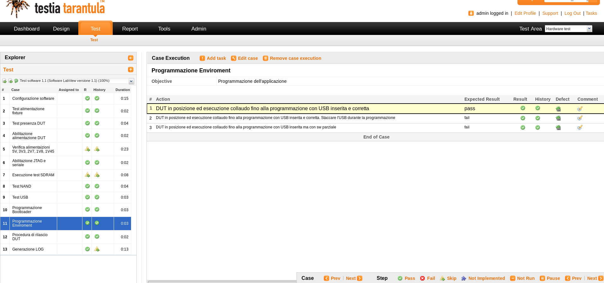
]

???
---

.left-column[
## Test plan
]

.right-column[
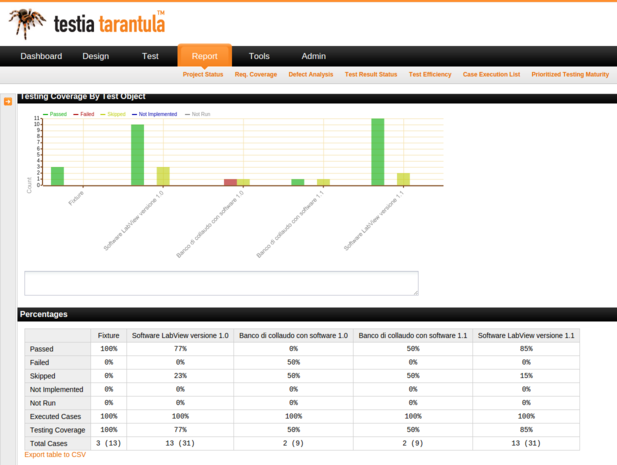
]

???
---

.left-column[
## Test plan
]

.right-column[
> Need to adapt to client politics

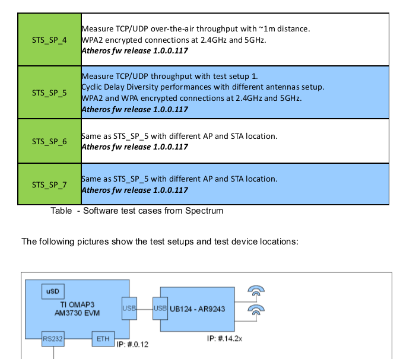
]

???
---

.left-column[
## Ideas for a change
]

.right-column[
### Ted conferences

  - passionate speakers that create a show
  - a show is another way of stimulating for change
  - change your mindset during specification will bring benefits
    to the entire project design cycle
  - have a look at *Start with why* (Simon Sinek)
]

???
---

.left-column[
## Any Question?
]

.right-column[
### Let's keep in touch

mail: stefano.costa@bluewind.it

twitter: @stefanobluewind

company: www.bluewind.it
]
