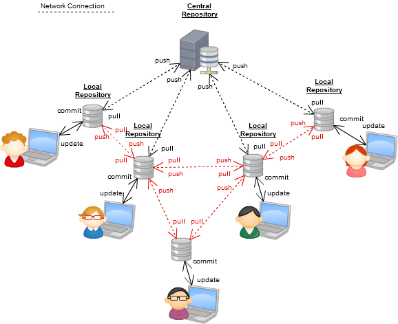
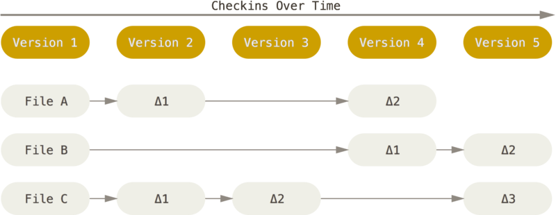
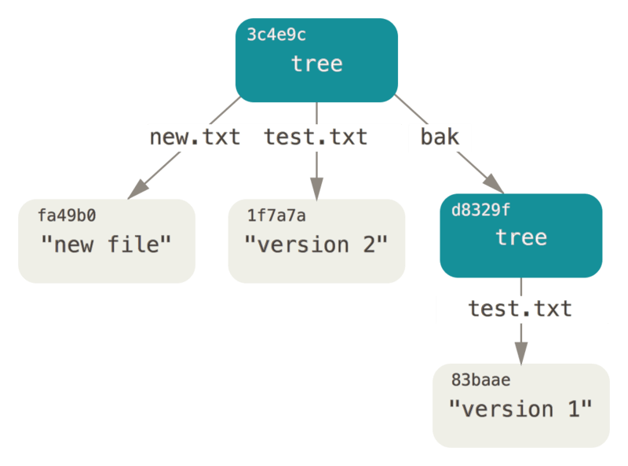
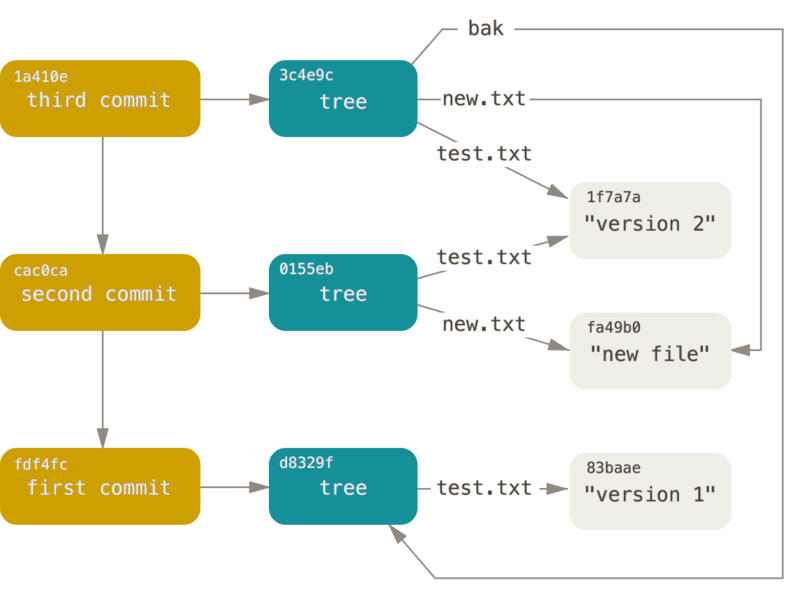
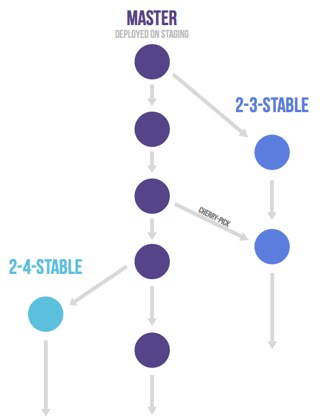
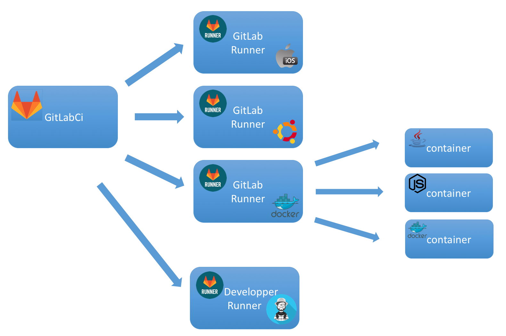

layout: true
.footer[
Software development training: modular architecture and reuse
]

???
---

# Software development training

### Developing with git, modular architectures

???
---

.left-column[
## Session 3:

## Modular architecture and reuse
]

.right-column[
### Topics

  - `git` and GitLab, VCS and `git` basics
  - why *feature branch*
  - workflows
  - issues and milestones driving delivery and collaboration
  - how to build libraries, APIs
]


???
---

.left-column[
## Version Control Systems
]

.right-column[
### Useful programming tool

  - record changes and keep track of releases
  - share and assign development tasks
  - backup
]

???
---

.left-column[
## CVCS
]

.right-column[
### Centralized model

  - `cvs`
  - `svn`
  - `mks` and other proprietary systems


  - *single point of failure*: the server
  - local working set: *current or specific snapshot*
]

???
---

.left-column[
## DVCS
]

.right-column[
### Distributed model

  - `git`
  - `mercurial`



  - each clone acts as a mirror
  - local working set: *full repository mirror*
]

???
---

.left-column[
## Meet git


]

.right-column[
### Brief history and basics

Designed 2005 by Linux Development Community

  - search for speed
  - support for non-linear development (parallel branches)
  - fully distributed

Data handling model basics

  - snapshot vs file-based changes
  - local operations vs network-connected
  - 3-stages vs 2-stages
]

???
---

.left-column[
## Meet git
]

.right-column[
### git base workflow


Most drawings from https://git-scm.com/
]

???
---

.left-column[
## git:

## the three states
]

.right-column[
### File states

  - *(untracked)*
  - modified
  - staged
  - commited
]

???
---

.left-column[
## git:

## basic commands
]

.right-column[
### Working with project files

```bash
# init a new repository
$ git init

# clone an existing one
$ git clone <repoURI>

# work with configuration
# (identity and tools)
$ git config

# extract snapshot to the working dir
$ git checkout <snapshotID>

# add files to tracked set / staged area
$ git add <files>

# store changes (locally)
$ git commit
```
]

???
---

.left-column[
## git:

## basic commands
]

.right-column[
### Review and tag

```bash
# review current repository status
$ git status

# show commit log
$ git log

# create / show tags
$ git tag <tagID>

# list ignored files / folders
$ cat .gitignore
```
]

???
---

.left-column[
## git:

## basic commands
]

.right-column[
### The remotes

  - each clone can point to one or more remote repositories
  - internet / local network hosted versions of a project
  - bare repository all teams agree to refer on

```bash
$ git remote add alias gituser@myrepo:path/repo.git
$ git remote -v

origin gituser@myrepo:path/repo.git (fetch)
origin gituser@myrepo:path/repo.git (push)
```

> centralized model still available!
]

???
---

.left-column[
## git:

## basic commands
]

.right-column[
### Working with remotes

working with remotes

```bash
# retrieve remote data
$ git fetch

# retrieve and merge remote data
$ git pull

# publish local data to remote repository
$ git push
```
]

???
---

.left-column[
## git:

## Data model
]

.right-column[
### Where do sources go?



Traditional VCS systems save *differences*
]

???
---

.left-column[
## git:

## Data model
]

.right-column[
### Where do sources go?


`git` and similar modern VCS systems save *snapshots*
]

???
---

.left-column[
## git:

## Data model
]

.right-column[
### Where do sources go?

  - everything is check-summed before storing
  - everything is referred to by its checksum
  

]

???
---

.left-column[
## git:

## Data model
]

.right-column[
### Where do sources go?

  - versioning as a *stream of snapshots*
  - commit as *reference to a snapshot*
  - most `git` commands *add* data, rarely *modify*
  

]

???
---

.left-column[
## git:

## Branching and merging
]

.right-column[
### Simple branches view


]

???
---

.left-column[
## git:

## Branching and merging
]

.right-column[
### git workflows

Several workflow models can be adopted

  - lightweight branch model
  - efficient three way merge
  - branch rebasing
]

???
---

.left-column[
## Meet Gitlab


]

.right-column[
### What Gitlab is

  - code hosting site (private github, bitbucket)
  - open-source community supported / commercial support

Main features:

  - `git` server
  - issue tracking
  - code reviews
  - project wiki
  - granular and group permissions
  - continuous integration (automation)
  - comprehensive webhooks

https://www.gitlab.com
]

???
---

.left-column[
## git:

## workflows
]

.right-column[
### The need for enforcing rules

  - `git` allows for centralized workflow:
    - one central hub
    - several nodes synchronized to it
  - same paradigm used by CVCS
  - locally exploit `git` efficient branch feature

> Without rules and conventions on branching,
repositories can quickly become a mess due to several
long-running development branches.

But the same applies to any collaborative development!!!
]

???
---

.left-column[
## git:

## workflows
]

.right-column[
### The local linear model


]

???
---

.left-column[
## git workflows:

## Vincent Driessen, 2010
]

.right-column[

]

???
---

.left-column[
## git workflows:

## Vincent Driessen, 2010
]

.right-column[
### In brief

  - `master` as production branch
  - `develop` as development branch
  - supporting branches: `features`, `release`, `hotfix`
  - main cons:
    - complexity
    - mandatory switch to `develop` branch
    - `hotfix` and `release` branches must merged into `develop`
]

???
---

.left-column[
## git workflows:

## GitHub
]

.right-column[

]

???
---

.left-column[
## git workflows:

## GitHub
]

.right-column[
### In brief

  - only `feature` and `master` branches
  - considered among the *lean* and *continuos-delivery* best practices
]

???
---

.left-column[
## git workflows:

## Gitlab
]

.right-column[
### Environment branches


]

???
---

.left-column[
## git workflows:

## Gitlab
]

.right-column[
### Releases branches


]

???
---

.left-column[
## git workflows:

## Gitlab
]

.right-column[
### In brief

  - *upstream-first* policy:
  - bugfixes first into master
  - *cherry-pick* to release/production branches


]

???
---

.left-column[
## git workflows:

## Gitlab
]

.right-column[
### Best practices

  - create a separate branch for every *small* feature
  - always start with an up-to-date *master* branch
  - rebase on another branch if required *before* pushing to a remote
  - each developer can work on their own feature and be isolated
  - frequent merge into mainline
  - avoid big merge steps
  - use CI from the start when available

]

???
---

.left-column[
## git workflows:

## Gitlab
]

.right-column[
### The merge request

  - ask an assigned person to merge two branches
  - sharing intermediate results with the team:
     - unassigned requests as code review tool
     - mention people on comments: `@user1`
     - *diff view* automatically updates with new commits
  - merge authorization control (roles)


]

???
---

.left-column[
## git workflows:

## Gitlab
]

.right-column[
### Enforcing collaboration with issues and milestones

*Milestones* as delivery steps

  - due date
  - issue references
  - members
  - merge requests


]

???
---

.left-column[
## git workflows:

## Gitlab
]

.right-column[
### Enforcing collaboration with issues and milestones

*Issues* as pace markers

  - goal definition
  - identify any significant code change
  - keep the team informed
  - create a branch for every issue


]

???
---

.left-column[
## git workflows:

## Gitlab
]

.right-column[
### Merge conflicts

How to avoid a lot of merge commits?

  - rebase only with not-pushed branches
  - cherry-pick instead of merge from master
  - avoid long lived branches / merge from master
  - keep feature branch shortlived
  - merge only at well-defined points
]

???
---

.left-column[
## git workflows:

## Gitlab
]

.right-column[
### Collaboration

How to enforce collaboration?

  - push feature branch frequently and/or assign tasks
  - remove merged branches
    - issue reopen can lead to the same branch name
  - commit early and often
    - use goal-reflecting messages
]

???
---

.left-column[
## git for modularity
]

.right-column[
### Submodules

Submodules are placeholders in a versioned sources tree,
linking to another sources tree maintaned in a separate repository.
*Can be a mess. But promote modularity.*

  - upgrades to the linked repository are not advertised
  - nothing guarantees for compatibility during evolution
  - commands are a bit obscure

> If the technological context allows for packaging
and formal dependency management, you should absolutely go this route.
(Christophe Porteneuve)
]

???
---
.left-column[
## A day in the life of a modular project
]

.right-column[
### Full example of a git cycle

We will:

  - create new repositories for a few modules
  - create a new repository for a project
  - define submodules for the project

We will work on local repositories inside two folders:

  - *public* acts as a reference repository
  - *private* acts as my local working folder

Credits https://git.wiki.kernel.org/
]

???
---
.left-column[
## A day in the life of a modular project
]

.right-column[
Create new modules

```bash
$ mkdir -p ~/subtut/private
$ mkdir -p ~/subtut/public
$ cd ~/subtut/private
$ for mod in a b c d; do
    mkdir $mod
    cd $mod
    git init
    echo "module $mod" > $mod.txt
    git add $mod.txt
    git commit -m "Initial commit, public module $mod"
    git clone --bare . ~/subtut/public/$mod.git
    git remote add origin ~/subtut/public/$mod.git
    git config branch.master.remote origin
    git config branch.master.merge refs/heads/master
    cd ..
done
```
]

???
---
.left-column[
## A day in the life of a modular project
]

.right-column[
Create a new superproject

```bash
$ cd ~/subtut/private
$ mkdir super
$ cd super
$ git init
$ echo hi > super.txt
$ git add super.txt
$ git commit -m "Initial commit of empty superproject"
$ git clone --bare . ~/subtut/public/super.git
$ git remote add origin ~/subtut/public/super.git
$ git config branch.master.remote origin
$ git config branch.master.merge refs/heads/master
```
]

???
---
.left-column[
## A day in the life of a modular project
]

.right-column[
Add modules to the superproject

```bash
$ cd ~/subtut/private
$ cd super
$ for mod in a b c d; do git submodule add ~/subtut/public/$mod.git $mod; done
$ ls -a
.  ..  .git  .gitmodules  a  b  c  d  super.txt
```

Please note the absolute reference to submodules repositories.
]

???
---
.left-column[
## A day in the life of a modular project
]

.right-column[
The `git submodule add` command:

  - clones the submodule under the current folder and checks out the master branch
  - adds the submodule's clone path to the `.gitmodules` file and adds this file to the index, ready to be committed
  - adds the submodule's current commit ID to the index, ready to be committed

From this perspective, submodules folders are populated with the sources now.
]

???
---
.left-column[
## A day in the life of a modular project
]

.right-column[
The `.gitmodules` file:

```bash
$ cat .gitmodules
[submodule "a"]
        path = a
        url = ~/subtut/public/a.git
[submodule "b"]
        path = b
        url = ~/subtut/public/b.git
        ...
$ git status
# On branch master
# Changes to be committed:
#   (use "git reset HEAD <file>..." to unstage)
#
#       new file:   .gitmodules
#       new file:   a
#       new file:   b
#       new file:   c
#       new file:   d
#
```
]

???
---
.left-column[
## A day in the life of a modular project
]

.right-column[
Let's commit and push the superproject:

```bash
$ git commit -m "Add submodules a, b, c, d."
Created commit fc7c350: Add submodules a, b, c, d.
 5 files changed, 16 insertions(+), 0 deletions(-)
 create mode 100644 .gitmodules
 create mode 160000 a
 create mode 160000 b
 create mode 160000 c
 create mode 160000 d
$ git push
$ git submodule init
```

The superproject is now ready to be developed
by any other team mate.
]

???
---
.left-column[
## A day in the life of a modular project
]

.right-column[
Start (clone) on superproject  as a new developer

```bash
$ mkdir ~/subtut/private2
$ cd !$
$ git clone ~/subtut/public/super.git
$ cd super
$ ls -a
.  ..  .git  .gitmodules  a  b  c  d  super.txt
```
]

???
---
.left-column[
## A day in the life of a modular project
]

.right-column[
The submodule directories are there, but they're empty

```bash
$ ls -a a
.  ..
$ git submodule status
-d266b9873ad50488163457f025db7cdd9683d88b a
-e81d457da15309b4fef4249aba9b50187999670d b
-c1536a972b9affea0f16e0680ba87332dc059146 c
-d96249ff5d57de5de093e6baff9e0aafa5276a74 d
```
]

???
---
.left-column[
## A day in the life of a modular project
]

.right-column[
That's because using defined submodules is a two-step process

  - `git submodule init` to add the submodule repository URLs to `.git/config`

```bash
$ git submodule init
$ git config -l
...
submodule.a.url=/home/moses/subtut/public/a.git
```

  - `git submodule update` to clone the repositories and check out the commits specified

```bash
$ git submodule update
```
]

???
---
.left-column[
## A day in the life of a modular project
]

.right-column[
The submodule directories have been filled

```bash
$ cd a
$ ls -a
.  ..  .git  a.txt
```
]

???
---

.left-column[
## Gitlab CI
]

.right-column[
### CI: continuous integration

Push to remote triggers operations on hosts


]

???
---

.left-column[
## Gitlab CI
]

.right-column[
### CI: continuous integration

CI operations can be executed inside *containers*


]

???
---

.left-column[
## Gitlab CI
]

.right-column[
### CI operations listed with sources

Definition of a post commit operation (1)

`gitlab-ci.yml`

```bash
# static analysis with coala framework
coala:
  image: bluewind/coala:latest
  script:
# this is needed in case of "strange chars" inside sources
#     - ./ci-tools/to_utf.sh src
     - coala-ci
  tags:
    - docker
```
]

???
---

.left-column[
## Gitlab CI
]

.right-column[
### CI operations listed with sources

Definition of a post commit operation (2)

`gitlab-ci.yml`

```bash
# unit tests with cpputest framework
unit:
  image: bluewind/coala:latest
  script:
    - wget https://github.com/cpputest/cpputest.github.io/blob/master/releases/cpputest-3.7.1.tar.gz?raw=true --output-document=cpputest-3.7.1.tar.gz
    - tar -xzf cpputest-3.7.1.tar.gz
    - pushd cpputest-3.7.1/build && autoreconf .. -i && ../configure --prefix=$HOME/cpputest && make && make install
    - export CPPUTEST_HOME=$HOME/cpputest
    - popd
    - make unit-test
  tags:
    - docker
```
]

???
---

.left-column[
## Gitlab CI
]

.right-column[
### CI operations listed with sources

Definition of a post commit operation (3)

`gitlab-ci.yml`

```bash
# unit test with unity / ceedling
unity:
  image: bluewind/ceedling
  script:
    - cd unit
    - rake test:all
  tags:
    - docker
  artifacts:
# do not keep artifacts (software documentation) for longer than ...
    expire_in: 1d
    untracked: true
```
]

???
---

.left-column[
## Gitlab CI
]

.right-column[
### CI operations listed with sources

Definition of a post commit operation (4)

`gitlab-ci.yml`

```bash
# documentation with doxygen
doxy:
  image: bluewind/doxy
  script:
    - doxygen .doxyfile
  tags:
    - doxygen
  artifacts:
# do not keep artifacts (software documentation) for longer than ...
    expire_in: 1d
    untracked: true
```
]

???
---

.left-column[
## Libraries
]

.right-column[
### How to build libraries

]

???

- how to build libraries?
- how to define API calls:
  - start from unit tests
- how to document existing libraries:
  - code review, add comments
  - add Doxygen comments

---

.left-column[
## Credits
]

.right-column[
### Read first

  - https://git-scm.com/
  - https://git-scm.com/book/en/v1 - https://git-scm.com/book/en/v2
  - https://about.gitlab.com/features/
  - https://about.gitlab.com/2014/09/29/gitlab-flow/
  - http://martinfowler.com/bliki/FeatureBranch.html
  - https://www.atlassian.com/git/tutorials/comparing-workflows
]

???
---

.left-column[
## Any Question?
]

.right-column[
Let's keep in touch!

mail: stefano.costa@bluewind.it

twitter: @stefanobluewind

company: www.bluewind.it
]
